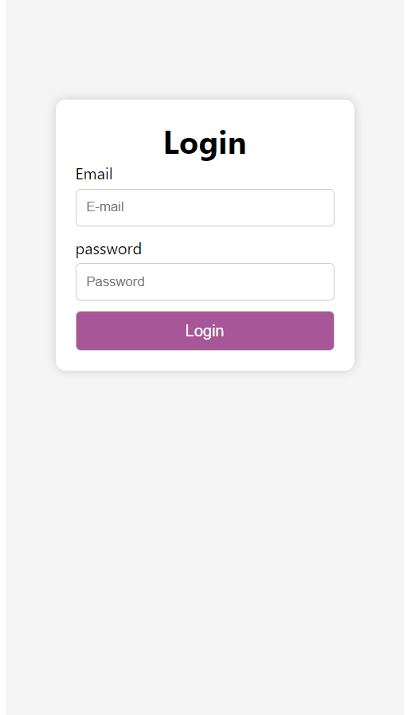
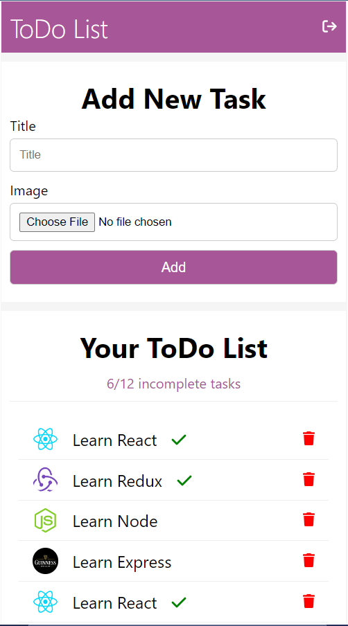
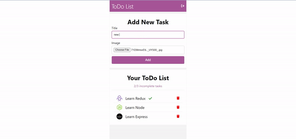
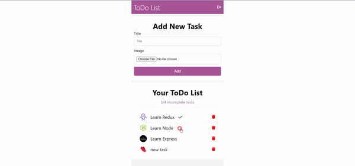
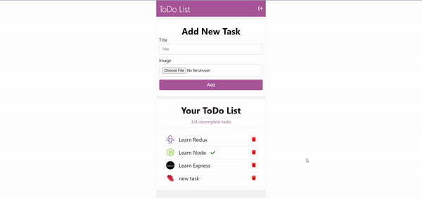
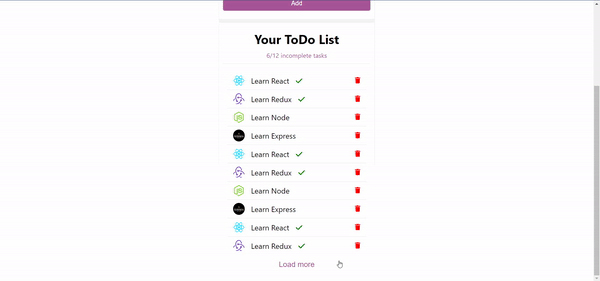
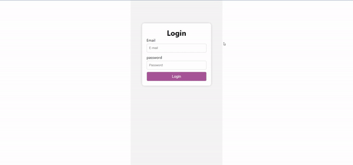

# To-Do List

## Explaneation
>Design
  - Simple design using pure css
  - Designed to fit mobile users
  - Common styles are defined in the App.css file
  - Component's style is defined in a separate css file

>Steps
  1. Designed the page (list and form) in terms of jsx components and css styling
  2. Added the validation to the form
  3. Added the functionality (add new task, mark task as completed, delete task, and count incomplete tasks)  
  4. Created PHP simple mock API for authentication (generated fake JWT token)
  5. Designed the login Form
  6. Linked the login form with the API using axios package
  7. Added the Auth context to verify logged in users
  8. Logged in users verified using the localStorage and the expiry date of the token returned from the API

## Packages used  
- Formik (for handling controlled components and form submission)
- Yup (for form validation)
- react-router-dom (for implementing routing)
- FontAwsomeIcon (for using fontawsome icons)
- axios (for HTTP requests)

## implementation

| Login | Home |  
| ----------------------------------------- | ----------------------------------------- |
|||

### Add Task


### Mark Task as Completed


### Delete Task


### Load More/Less


### Form Validation


<br />

## How To run
> ### Prerequisites
- Apache Server is required for running the API (Xampp Recomended)
- Git version control is required
- Move the file login.php located inside APIs folder at the app level into the apache server main folder (htdocs in case of xampp)
- Run the server

> ### Installation
1. Clone the repo
```
git clone https://github.com/asmaahamid02/todolist.git
```

2. Install packages
```
npm install
```

3. Run the App
```
npm start
```

> Data for logging in
```
{
    'email': 'asmaa@gmail.com'
    'password': '123456'
}
```


